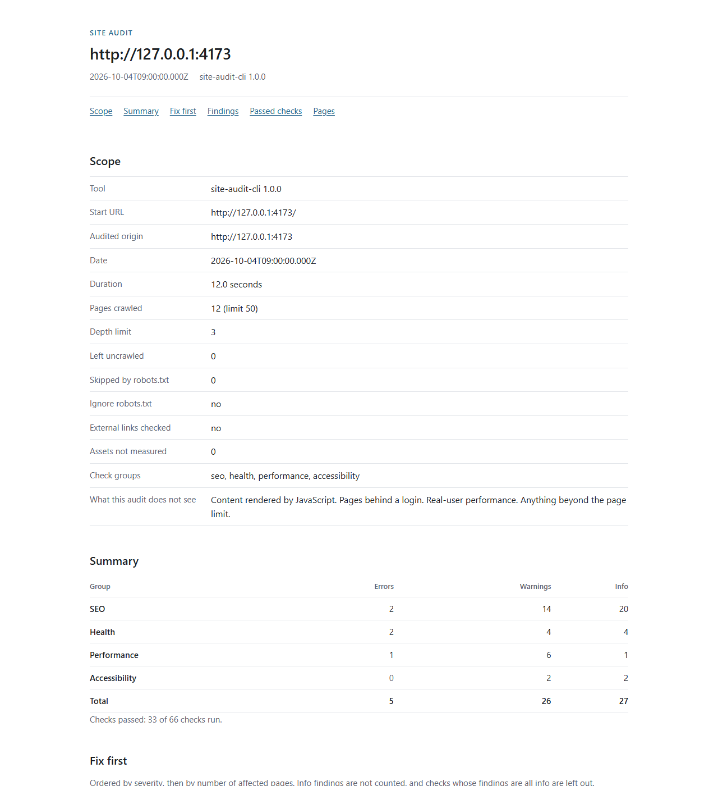

# site-audit-cli

A command-line site audit for SEO, health, performance and static accessibility checks. It crawls politely, runs its own checks over plain HTTP, and reports findings with a fix for each one. It does not give a score.



The screenshot shows the HTML report for the fixture site that ships with the tests. That site is broken on purpose, so the numbers in it say nothing about real sites.

## Quick start

```
npx github:talha55/site-audit-cli https://example.com
```

The report is printed to the terminal as text. To write a self-contained HTML report you can send to a client, give an output file:

```
npx github:talha55/site-audit-cli https://example.com --output report.html
```

The format is taken from the file extension (`.html`, `.json`, `.md`) unless you pass `--format`. A bare host such as `example.com` is read as `https://example.com/`. Node 20.18.1 or later is required. Installing from GitHub builds the package with the `prepare` script.

To work from a clone instead:

```
npm ci
npm run build
node dist/cli.js https://example.com
```

## What it checks

There are 69 checks in four groups. Every check has an id, a default severity (error, warning or info), a reason it matters and a plain fix. Where a check uses a threshold, the threshold is a rule of thumb and the reference says so.

- 30 SEO checks: titles, meta descriptions, h1 headings, canonical links, noindex directives, the lang attribute, the viewport tag, Open Graph tags, JSON-LD syntax, robots.txt, sitemaps and pages with little text.
- 17 health checks: broken and redirecting internal links, redirect chains and loops, HTTPS and mixed content, www and apex hosts, soft 404 pages, the favicon, common security headers, broken external links (with `--check-external`) and pages that timed out or were cut short.
- 15 performance checks: server response time, HTML size, compression, cache lifetimes, page weight, image size, dimensions, lazy loading and format, render-blocking scripts and stylesheets, and the number of resources a page references.
- 7 accessibility checks, static checks only, not an accessibility audit: image alt text, form labels, link names, generic link text, button names, skipped heading levels and iframe titles. Contrast, keyboard use, focus order and screen reader behaviour are not tested.

The full list, with the reason, the fix and the threshold for each check, is in [docs/checks.md](docs/checks.md). You can print the same reference from the tool with `npx github:talha55/site-audit-cli checks`, or `site-audit checks` once it is installed. Add `--format markdown` for the Markdown form.

## What it does not do

- It does not run JavaScript. Content that a script builds in the browser is not seen, and the report says so.
- It is not an accessibility audit. The seven accessibility checks look at the HTML only.
- It does not log in. Pages behind a login, cookies and forms are out of reach by design.
- It does not measure real-user performance. The response time is one measurement from the machine that runs the audit.
- It does not read gzip-compressed sitemaps. It notes them and moves on.
- It follows only `<a href>` links and the URLs in sitemaps. It does not find pages that are reachable only through scripts or forms.
- It does not measure the size of fonts or other files it only learns about from a stylesheet.
- It does not give a score or a grade. See [Why there is no score](#why-there-is-no-score).

## Limits

- It stops at `--max-pages` HTML pages. Linked files that are not HTML have a cap of their own, equal to `--max-pages`. Both caps apply to the same crawl loop, which stops when either is reached, so a site whose first links are mostly files can leave HTML pages uncrawled. The report says how many discovered URLs were left uncrawled.
- A response body is read up to 5 MB. A longer page is cut there and reported as truncated.
- At most 5 sitemap files are read and at most 5000 sitemap URLs are kept.
- A page that nests elements deeper than 256 levels or has more than 500000 nodes is read up to that point and reported as truncated. Sloppy markup with very many unclosed tags can reach the nesting limit.
- At most 5000 of each kind of item are kept per page: links, images, scripts, stylesheets, form controls, buttons, iframes, headings, JSON-LD blocks and mixed-content URLs. A page over a cap is reported as truncated.
- The HTML parser does not repair markup the way a browser does. Text after a misplaced `</body>` is not counted as page text. An `<a>` that is never closed holds the links that follow it. A comment opener inside `iframe`, `noembed`, `noframes` or `noscript` hides the rest of the page.
- robots.txt is read and obeyed only for the audited site. See the next section.
- The Lighthouse integration is tested with a stand-in runner and a hand-written result, not against a real Lighthouse run.
- On Windows, some Node versions can abort when a program opens many connections to 127.0.0.1. This was observed with Node 24.15 while testing against a local fixture server, and it is a fault in the runtime, not in this tool. It is not expected when auditing a remote site. If an audit of a localhost address stops without a report, run it again.

## How it behaves on your site

- It sends only GET and HEAD requests.
- It identifies itself with its own user agent, `site-audit-cli/<version> (+https://github.com/talha55/site-audit-cli)`. You can change the header with `--user-agent`. robots.txt is matched against the token `site-audit-cli`.
- For the audited site it reads robots.txt before the start page and obeys its rules. robots.txt itself is always requested. A URL on the audited host that its robots.txt disallows is not requested, whatever its scheme or port, with one exception: sitemap files (those robots.txt names, those a sitemap index lists, and the same-site redirect targets of any sitemap URL) are read even when their paths are disallowed. A guessed `/sitemap.xml` is not requested when robots.txt disallows it. A start URL that robots.txt disallows is never requested. Skipped URLs are counted in every report format and listed in the JSON report.
- It sends at most one new request per second to a host by default, with up to two in flight. A robots.txt `Crawl-delay` larger than `--delay` wins, up to 30 seconds. When it does, a note on stderr says so and the scope block of the report shows it. Other notes, such as a moved origin, are printed on stderr too.
- It backs off on 429 and 503 when it fetches pages, robots.txt, sitemaps and the soft 404 probe. It waits for `Retry-After` (up to 60 seconds, 5 seconds when the header is missing), retries up to twice, and after repeated 429 or 503 answers it doubles that host's delay once for the rest of the run. Asset size requests, external link checks and the other probes are not retried.
- The crawler stores and sends no cookies, and it sends no `Authorization` header. It never submits a form.
- If the start URL redirects to another origin, the audit moves there and says so. It may move up to three times while it stays on the same site (for example from `http://example.com` to `https://www.example.com`), reading each new origin's robots.txt first, and once to a different site.
- Besides the audited origin it contacts a few other hosts: the `www` or apex counterpart of the host, which the plain-HTTP probe may also reach through a redirect, and with `--check-external` the hosts of external links and third-party assets. Other hosts get one request at a time with the same `--delay` gap. Their robots.txt is not read.
- Requests to other hosts never leave the site they were sent to. URLs on the audited host under another scheme or port, such as `http://` links on an `https` site, follow the audited site's robots.txt rules and its pace. Redirects of robots.txt and sitemaps are followed only within the same site: the same hostname (for example http to https) or its www or apex counterpart.
- Linked files that are not HTML are fetched only up to a cap equal to `--max-pages`. Bodies that are not text, such as PDFs or images, are not downloaded. Text-like files (any `text/` type, XML including SVG, and JSON) are read up to the 5 MB cap.
- A few probes describe the site as a whole: the plain-HTTP version of the home page, the `www` or apex counterpart, a random path that should not exist (to spot soft 404 pages) and `/favicon.ico`. A probe can take more than one request: redirects on the audited site are followed and throttling answers are retried. A probe whose URL robots.txt disallows is not sent.
- `--ignore-robots` is for sites you own or have permission to audit. The report shows a notice when it is used.
- `--lighthouse` loads pages in a real browser, which contacts the third parties those pages use and may set cookies in that browser. The rules above (GET and HEAD only, robots.txt, pacing, no cookies) describe the crawler. They do not apply to the browser that Lighthouse starts.

The crawl order, the limits and each extra request are described in [docs/how-it-crawls.md](docs/how-it-crawls.md).

## Options

```
site-audit <url> [options]
site-audit checks [--format text|markdown]
site-audit --version | --help
```

| Option                                | Default                                                                 | Meaning                                                                                                                              |
| ------------------------------------- | ----------------------------------------------------------------------- | ------------------------------------------------------------------------------------------------------------------------------------ |
| `--format text\|json\|markdown\|html` | `text`                                                                  | Report format.                                                                                                                       |
| `--output FILE`                       | stdout                                                                  | Write the report to a file. The format is inferred from `.json`, `.md`, `.markdown`, `.html` or `.htm` when `--format` is absent.    |
| `--max-pages N`                       | `50`                                                                    | Stop after N HTML pages, 1 to 2000. Linked files that are not HTML have a separate cap of N.                                         |
| `--max-depth N`                       | `3`                                                                     | Link depth from the start URL, 0 to 20.                                                                                              |
| `--concurrency N`                     | `2`                                                                     | Parallel requests per host, 1 to 8.                                                                                                  |
| `--delay MS`                          | `1000`                                                                  | Minimum gap between request starts to one host, 0 to 60000. A larger robots.txt `Crawl-delay` wins.                                  |
| `--timeout MS`                        | `15000`                                                                 | Time limit per request, 1000 to 120000.                                                                                              |
| `--max-assets N`                      | `300`                                                                   | Cap on unique asset size probes, 0 to 5000.                                                                                          |
| `--exclude PATTERN`                   | none                                                                    | Skip URLs whose path matches the glob (`*` and `**` only). Can be repeated.                                                          |
| `--check-external`                    | off                                                                     | Allow requests to other hosts: external link checks and third-party asset sizes.                                                     |
| `--ignore-robots`                     | off                                                                     | Do not apply robots.txt. For sites you own or have permission to audit. The report shows a notice.                                   |
| `--user-agent STRING`                 | `site-audit-cli/<version> (+https://github.com/talha55/site-audit-cli)` | Request header. robots.txt matching uses the token `site-audit-cli`.                                                                 |
| `--only GROUP[,GROUP]`                | all groups                                                              | Limit to groups: `seo`, `health`, `performance`, `accessibility`.                                                                    |
| `--lighthouse`                        | off                                                                     | Add Lighthouse lab results for the start URL.                                                                                        |
| `--lighthouse-pages N`                | `1`                                                                     | Lighthouse pages, 1 to 5. The start URL comes first, then pages in crawl order.                                                      |
| `--lighthouse-path PATH`              | auto                                                                    | Path to an installed `lighthouse` package folder.                                                                                    |
| `--fail-on error\|warning\|never`     | `error`                                                                 | Which severity makes the exit code 1.                                                                                                |
| `--no-color`                          | colour on a terminal                                                    | Disable colour. Colour is also off when stdout is not a terminal, when `NO_COLOR` is set and not empty, and when `--output` is used. |
| `--quiet`                             | off                                                                     | No progress or notes on stderr.                                                                                                      |
| `--version`                           |                                                                         | Print the version.                                                                                                                   |
| `--help`                              |                                                                         | Print the help text.                                                                                                                 |

Progress and notes go to stderr, and the report goes to stdout or to `--output`. The start URL must use http or https. An `--output` path is checked before the crawl starts, so a path that cannot be written ends the run with exit code 2 before any request is made.

## Report formats

Each format opens with a scope block: the tool version, the start URL and audited origin, the date and duration, pages crawled against the limit, pages left uncrawled, the number of URLs skipped because of robots.txt, whether `--ignore-robots` or `--check-external` was used, assets not measured, the applied robots.txt `Crawl-delay` when there is one, and a fixed list of what the audit does not see.

Text and Markdown list the first 10 findings of each check and then say how many more there are. HTML lists the first 50. JSON is the complete record, with every finding and the list of URLs skipped because of robots.txt.

| Format   | Use it for                                                                         | Example                                      |
| -------- | ---------------------------------------------------------------------------------- | -------------------------------------------- |
| text     | Reading in a terminal. The default.                                                | [examples/report.txt](examples/report.txt)   |
| markdown | Pasting into a ticket or a proposal.                                               | [examples/report.md](examples/report.md)     |
| json     | Pipelines and scripts. The shape is in [docs/json-schema.md](docs/json-schema.md). | [examples/report.json](examples/report.json) |
| html     | One self-contained file to hand to a client.                                       | [examples/report.html](examples/report.html) |

The HTML report has inline CSS, needs no scripts to read and makes no requests to other hosts. It follows the light or dark setting of the reader and has a print stylesheet, so the browser can save it to PDF.

The example reports come from the bundled fixture site on `127.0.0.1` with timings normalised so the files are reproducible. The address `127.0.0.1:4173` in them is the fixture server. Run `npm run examples` to regenerate the four report files. The screenshot `examples/report.png` is not regenerated by that command.

Text that comes from the audited site is cleaned before it reaches a report: control characters, terminal escape sequences and bidirectional override characters are removed, long values are cut, and each format escapes what it needs to.

## Exit codes and CI

| Code | Meaning                                                                            |
| ---- | ---------------------------------------------------------------------------------- |
| 0    | No finding at or above the `--fail-on` severity.                                   |
| 1    | At least one finding at or above the `--fail-on` severity. The default is `error`. |
| 2    | Usage error, or an `--output` path that cannot be written.                         |
| 3    | The start URL could not be audited. See below.                                     |

Exit code 3 covers a start URL that cannot be reached (DNS failure, refused connection, timeout, certificate failure), one that answers with status 400 or above, one that is not an HTML page, one that robots.txt disallows, and a robots.txt that cannot be read (a server error, a network failure or a redirect to another site). `--ignore-robots` lifts the two robots.txt cases.

A GitHub Actions job that audits a staging site, fails on warnings and keeps the HTML report:

```yaml
name: Site audit
on:
  workflow_dispatch:

permissions:
  contents: read

jobs:
  audit:
    runs-on: ubuntu-latest
    timeout-minutes: 15
    steps:
      - uses: actions/setup-node@v4
        with:
          node-version: 22
      - name: Audit
        run: npx github:talha55/site-audit-cli https://staging.example.com --max-pages 30 --fail-on warning --quiet --output audit.html
      - uses: actions/upload-artifact@v4
        if: always()
        with:
          name: site-audit
          path: audit.html
```

Only audit sites you own or have permission to audit. Keep `--max-pages` and `--delay` modest so the job does not load the site.

## Optional Lighthouse

`--lighthouse` adds Lighthouse lab results to the report. Lighthouse is not a dependency of this package. Install it yourself and make sure Chrome is available:

```
npm i -g lighthouse
```

The tool looks for Lighthouse in this order: the folder given with `--lighthouse-path`, with no fallback when Lighthouse is not there; `node_modules/lighthouse` in the current folder or any folder above it; a global install found beside the `lighthouse` command on your `PATH`. If none is found the audit still completes, the Lighthouse section says it was not run, and stderr explains how to install it. When a Lighthouse run fails, the report gives a fixed message, not Lighthouse's own error text.

Lighthouse runs as a child process, one page at a time, with a 120 second limit per page. It starts a real browser, which contacts the third parties the pages use and may set cookies in that browser. `--lighthouse-pages` raises the number of pages up to 5. The report shows the four category scores and the lab metrics FCP, LCP, TBT, CLS and Speed Index for each page, with the Lighthouse version. It is one run on your machine with mobile emulation, and results vary between runs.

Lighthouse results never feed the tool's own findings or its exit code. The integration is covered by tests that use a stand-in runner and a parser fed with a hand-written result. No test starts Chrome or runs a real Lighthouse.

## Programmatic use

```ts
import { audit, DEFAULT_OPTIONS, parseStartUrl } from "site-audit-cli";

const result = await audit({
  ...DEFAULT_OPTIONS,
  startUrl: parseStartUrl("https://example.com"),
  maxPages: 20,
});

console.log(result.summary.byGroup);
```

Install it from GitHub with `npm install github:talha55/site-audit-cli`. The package exports `audit`, `DEFAULT_OPTIONS`, `parseStartUrl`, `CHECKS`, `VERSION`, the error classes `UnreachableError` and `UsageError`, and the types. `audit` resolves to the object described in [docs/json-schema.md](docs/json-schema.md). It rejects with an `UnreachableError` when the start URL cannot be audited. `lighthouse: true` in the options has no effect unless you also pass a `lighthouse` function in the second argument. The report renderers are not part of the package interface. Use the command line for the text, Markdown and HTML formats.

## Why there is no score

A single number from 0 to 100 needs weights, and the weights would be invented. Two sites with the same number can have very different problems, and a client reads the number and not the findings. So the report lists what was found, names the pages, and says what to change.

Findings keep their own severity. The "Fix first" list shows up to five failed checks, errors before warnings and then by the number of affected pages. Info findings are left out of it, and so are checks whose findings are all info.

## Roadmap

These are ideas, not promises:

- JavaScript rendering, so client-built content can be audited.
- A config file as an alternative to flags.
- White-label options for the HTML report.
- Keeping results over time to show what changed between runs.

## Contributing a check

A check is a small function over the crawl result, with a spec, a positive test and a negative test. [CONTRIBUTING.md](CONTRIBUTING.md) has the setup, the commands to run before a pull request and the steps to add a check.

## Licence

MIT. Copyright 2026 Talha Muneer. See [LICENSE](LICENSE).
